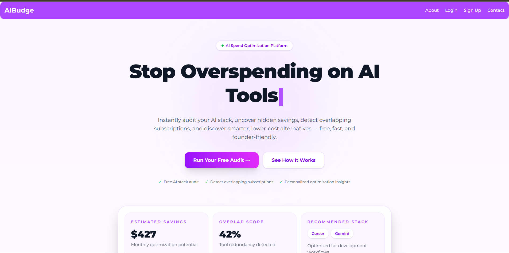
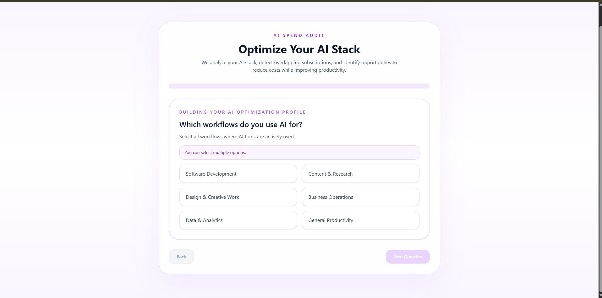

# AIBudge 💸

> **AI subscription tracker that audits what you spend on AI tools — and tells you exactly where you're overpaying.**  
> Answer 6 quick questions, get a personalised spend report, and download it as a PDF in under 2 minutes.  
> Built in 4 days as a full-stack React + Node.js app, live at [ai-budge.vercel.app](https://ai-budge.vercel.app).

🔗 **[Try it live → ai-budge.vercel.app](https://ai-budge.vercel.app)**

---

## Screenshots

| Landing Page | Spend Form | Summary Report |
|:---:|:---:|:---:|
|  |  |  |


---

## Quick Start

### Prerequisites

- Node.js v18+
- npm

### Install & Run Locally

```bash
# 1. Clone the repo
git clone https://github.com/madhavmishra09/AIBudge.git
cd AIBudge

# 2. Set up and start the backend
cd backend
npm install
npm start
# → Server running on http://localhost:3000

# 3. In a new terminal, set up and start the frontend
cd ../frontend
npm install
npm run dev
# → App running on http://localhost:5173
```

Open [http://localhost:5173](http://localhost:5173) in your browser. Create an account and run your first audit.

### Environment Variables

Create a `.env` file inside `backend/` based on this template:

```env
PORT=3000
DATABASE_URL=your_database_connection_string
JWT_SECRET=your_jwt_secret_key
EMAIL_HOST=your_smtp_host
EMAIL_USER=your_email
EMAIL_PASS=your_email_password
```

### Deploy to Vercel (Frontend)

```bash
cd frontend
npm run build
npx vercel --prod
```

The backend can be deployed to Railway, Render, or any Node-compatible host. Point `VITE_API_URL` in your frontend `.env` to the deployed backend URL before building.

---

## How It Works

```
Landing Page  →  Sign Up / Log In  →  Spend Form (6 questions)  →  Summary Report  →  Download PDF
```

1. **Sign up or log in** — secure auth with JWT and password reset via email
2. **Answer 6 questions** — which tools you use, which plan you're on, and why you use them
3. **Get your audit** — monthly spend, annual projection, and cheaper alternatives highlighted
4. **Download your report** — client-side PDF generated via html2pdf.js, no server round-trip

---

## Features

- 🔐 Sign-up, login, and forgot-password flow
- 📋 6-step progressive button form — no typing, just tapping
- 🛠️ Covers Cursor, GitHub Copilot, Claude, ChatGPT, Gemini, OpenAI API, and custom tools
- 📊 Spend report with monthly, annual, and savings figures
- 💡 Cheaper plan recommendations based on verified pricing data
- 📄 One-click PDF download (client-side, no backend needed)
- 💾 Reports saved to database and linked to your account
- 📱 Responsive on mobile, tablet, and desktop

---

## Tech Stack

| Layer | Technology |
|-------|-----------|
| Frontend | React, React Router v6, html2pdf.js |
| State / Navigation | `useState`, `useNavigate`, Router state passing |
| Backend | Node.js, Express |
| Database | SQL (users + audits schema) |
| Auth | JWT, bcrypt |
| Hosting | Vercel (frontend) |

---

## Decisions

Five real trade-offs made during the 4-day build — and why.

### 1. Button-based form instead of free-text inputs

Typing monthly spend amounts is error-prone and kills conversion. Replacing the form with pre-set button choices (e.g. "Free", "$10–$20/mo", "$20–$50/mo") means users can complete the audit in seconds without thinking about exact figures. The trade-off is reduced precision — but for a spend-awareness tool, getting people to _finish_ matters more than capturing down-to-the-cent accuracy.

### 2. Client-side PDF generation (html2pdf.js) instead of server-side rendering

Generating the PDF entirely in the browser means no extra server endpoint, no storage costs, and instant downloads. The trade-off is that complex layouts can behave inconsistently across browsers and the library adds to the bundle size. For a report that's essentially a styled HTML page, this was the right call for speed of delivery.

### 3. React Router `state` passing instead of a shared store (Redux/Zustand)

Form answers are passed to the Summary Report page via `useNavigate` + Router state rather than setting up a global state manager. This keeps the codebase simple and avoids boilerplate for a linear 3-page flow. The trade-off is that refreshing the report page loses the in-memory data — acceptable here because reports are also persisted in the database.

### 4. Manually curated pricing data (`PRICING_DATA.md`) instead of live scraping

AI tool pricing changes frequently but none of the major providers expose a public pricing API. Scraping their pages would be fragile and legally grey. Instead, pricing is maintained in a human-readable markdown file with verification dates, making staleness visible and the dataset a defensible, trusted asset. The trade-off is that it requires periodic manual updates.

### 5. Separate `frontend/` + `backend/` monorepo instead of a Next.js fullstack app

Keeping React and Express as separate processes allows each layer to be deployed and scaled independently, and avoids coupling the frontend framework to the backend. The trade-off is a slightly more involved setup — two `npm install` steps, CORS configuration, two deployment targets — compared to a single Next.js app. Given the goal of learning both sides independently and shipping fast, the split was worth it.

---

## Project Structure

```
AIBudge/
├── frontend/              # React app
│   └── src/
│       ├── pages/         # LandingPage, SpendForm, SummaryReport
│       └── components/    # Navbar, reusable buttons, form elements
├── backend/               # Express server + DB schema
├── PRICING_DATA.md        # Verified AI tool pricing (updated regularly)
├── TESTS.md               # 100+ manual test cases
├── DEVLOG.md              # Day-by-day build log
├── ECONOMICS.md           # Business model and unit economics
└── ARCHITECTURE.md        # System design notes
```

---

## AI Tools & Pricing Covered

| Tool | Free? | Cheapest Paid | Source |
|------|-------|--------------|--------|
| Cursor | ✅ Hobby | $20/mo (Pro) | [cursor.com/pricing](https://cursor.com/pricing) |
| GitHub Copilot | ✅ Free | $10/mo (Pro) | [github.com/features/copilot](https://github.com/features/copilot/plans) |
| Claude | ✅ Free | $17/mo (Pro) | [claude.ai/upgrade](https://claude.ai/upgrade) |
| ChatGPT (India) | ✅ Go | INR 1,999/mo (Plus) | [chatgpt.com/#pricing](https://chatgpt.com/#pricing) |
| Gemini (India) | ✅ Free | INR 399/mo (AI Plus) | [gemini.google/subscriptions](https://gemini.google/subscriptions/) |
| OpenAI API | Pay-as-you-go | — | [openai.com/api/pricing](https://openai.com/api/pricing/) |

> Pricing verified May 2026. See [`PRICING_DATA.md`](./PRICING_DATA.md) for full tier breakdowns.

---

## Roadmap

- [ ] AI-powered recommendations via LLM (Ollama integration)
- [ ] Pie charts and savings visualisations on the report
- [ ] Shareable audit report links
- [ ] Automated test suite (Vitest + Playwright)
- [ ] Email digest: alert users when a cheaper plan becomes available

---

## Repo Docs

| File | What's in it |
|------|-------------|
| [`DEVLOG.md`](./DEVLOG.md) | Day-by-day build log across 4 days |
| [`PRICING_DATA.md`](./PRICING_DATA.md) | Verified pricing for all supported AI tools |
| [`TESTS.md`](./TESTS.md) | 100+ manual test cases across auth, form, API, and DB |
| [`ECONOMICS.md`](./ECONOMICS.md) | Business model, unit economics, scalability notes |
| [`ARCHITECTURE.md`](./ARCHITECTURE.md) | System design decisions |

---

## Author

Built by [Madhav Mishra](https://github.com/madhavmishra09) — idea to deployed product in 4 days.